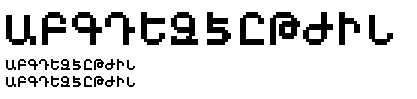

# ots_font

Armenian pixel font made using [bitfontmaker2](https://www.pentacom.jp/pentacom/bitfontmaker2/#)

*v0.01*

## Import

You can import the font into bitfontmaker2 using the .txt file.

## Versions

### v0.01

- Font only works with english letters (not unicode)
- Letters [Ա, Բ, Գ, Դ, Ե, Զ, Է, Ը, Թ, Ժ, Ի, Լ]
